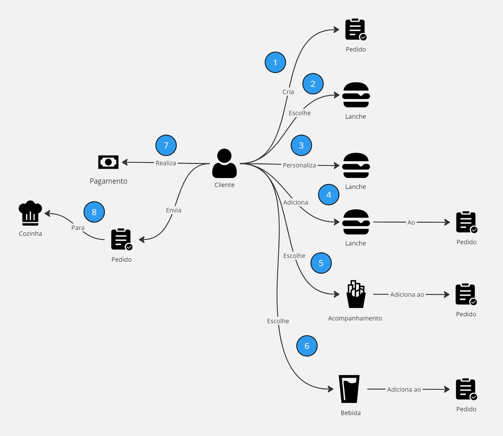
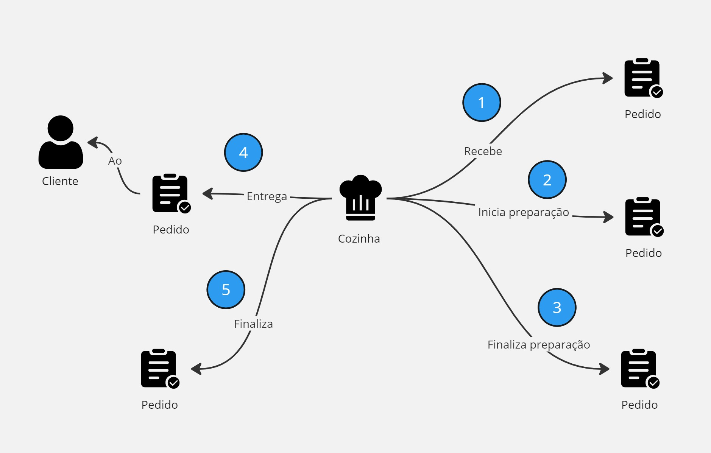
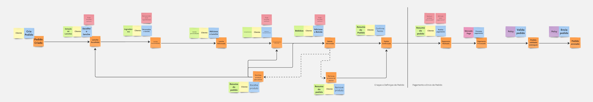
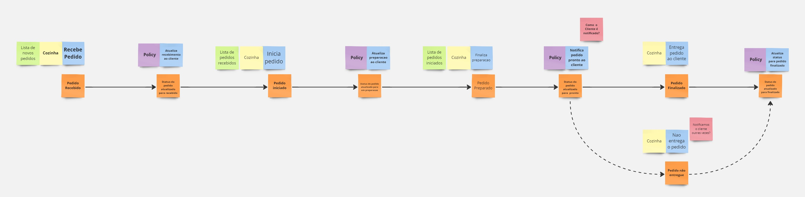
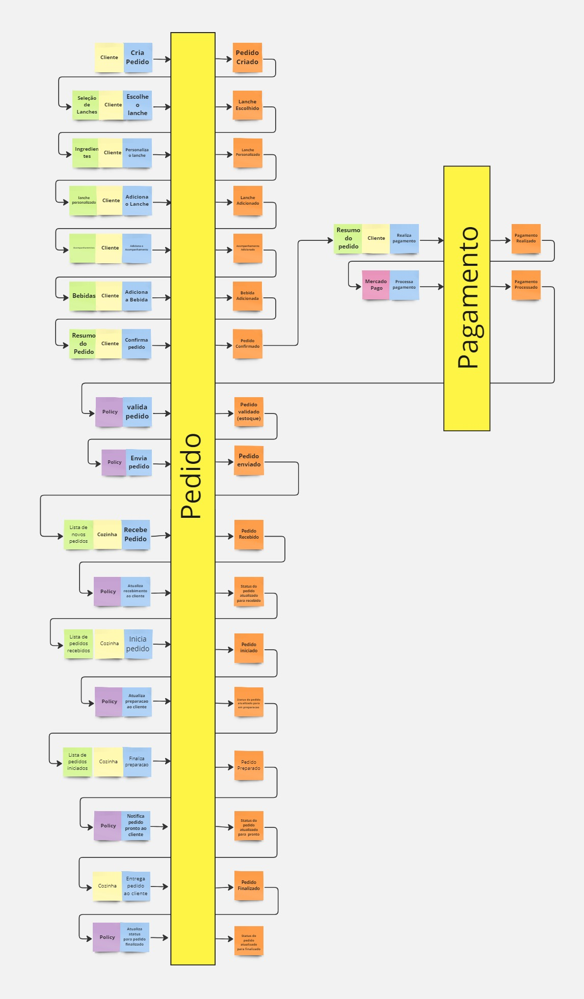

## Domain-Driven Design

### Glossário da Linguagem Ubíqua

!!! BUG ""
    A comunicação clara e eficaz é um pilar fundamental no desenvolvimento de sistemas complexos, especialmente quando se trata de traduzir as necessidades do negócio em soluções tecnológicas. No contexto do projeto de autoatendimento para a lanchonete, é essencial estabelecer uma linguagem comum que seja compreendida por todos os envolvidos, desde a equipe de desenvolvimento até os funcionários e clientes do estabelecimento.

    Para alcançar esse objetivo, adotamos o conceito de **Linguagem Ubíqua** do Domain-Driven Design (DDD), criado por Eric Evans. Esta linguagem ubíqua serve como uma ponte entre o domínio do negócio e o modelo técnico, garantindo que todos os termos e conceitos sejam usados de forma consistente e sem ambiguidades.

O glossário a seguir é uma compilação dos termos-chave que formam a base da nossa linguagem ubíqua. Ele serve como uma referência rápida para entender os elementos e processos que compõem o sistema de autoatendimento da lanchonete, assegurando que a comunicação seja precisa e alinhada com as necessidades do projeto.

- **Pedido**: Uma solicitação feita por um cliente para produtos específicos, que pode incluir um lanche, acompanhamento, bebida e/ou sobremesa.
- **Cliente**: A pessoa que faz um pedido na lanchonete. Pode ser identificado por CPF, nome, e-mail ou permanecer anônimo.
- **Cozinha**: Conjunto de funcionários responsáveis pela preparação dos produtos que compõem um pedido trabalhando em conjunto em um espaço físico designado.
- **Produto**: Cada um dos itens do menu que podem ser selecionados para compor um pedido. Todo produto possui um nome, uma descrição e um preço.
- **Categoria**: Classificação do produto. Pode ser *Lanche*, *Acompanhamento*, *Bebida* ou *Sobremesa*:
    - **Lanche**: Um produto de menu principal que pode ser personalizado com ingredientes específicos.
    - **Acompanhamento**: Um produto adicional que complementa o lanche, como batatas fritas.
    - **Bebida**: Uma bebida que acompanha o lanche e o acompanhamento.
    - **Sobremesa**: Um produto de menu doce servido após a refeição principal.
- **Combo**: Uma combinação de produtos de menu selecionados pelo cliente, geralmente incluindo um lanche principal, acompanhamento e bebida.
- **Menu**: Conjunto de produtos organizados por categorias que podem ser selecionados para compor um pedido.
- **Sistema de Autoatendimento**: Uma solução tecnológica que permite aos clientes fazer pedidos e pagamentos por meio de uma interface digital sem a necessidade de interação direta com atendentes.
- **Monitor de Acompanhamento**: Dispositivo que exibe o progresso do pedido para o cliente, com etapas como *Recebido*, *Em preparação*, *Pronto* e *Finalizado*:
    - **Recebido**: O status inicial de um pedido após ser submetido pelo cliente, indicando que o pedido foi recebido pelo sistema e está aguardando para ser processado.
    - **Em Preparação**: O status de um pedido que está sendo preparado pela cozinha. Nesta etapa, os ingredientes estão sendo montados e o pedido está em processo de ser concluído.
    - **Pronto**: O status que indica que o pedido foi preparado e está pronto para ser entregue ou retirado pelo cliente.
    - **Finalizado**: O status final de um pedido, que ocorre após o cliente retirar o pedido. Indica que o ciclo do pedido foi completado e que não há mais ações pendentes.
- **Usuário**: Funcionário do estabelecimento com acesso à interface ou portal para gerenciamento de clientes, produtos, categorias e acompanhamento de pedidos.
- **Acesso Administrativo**: Interface ou portal que permite ao estabelecimento gerenciar clientes, produtos, categorias e acompanhar pedidos.
- **Campanhas Promocionais**: Estratégias de marketing para incentivar vendas ou fidelizar clientes, utilizando a identificação dos mesmos.

---

### Técnias de Modelagem de Domínio

Para garantir uma compreensão profunda e compartilhada dos processos críticos do nosso sistema de autoatendimento, utilizamos técnicas colaborativas de modelagem de domínio: o **Domain Storytelling** e o **Event Storming**. Essas técnicas nos permitem visualizar e explorar os fluxos de negócio, capturando a essência das interações e eventos que ocorrem durante a realização de pedidos e pagamentos, bem como a preparação e entrega dos pedidos.

Os diagramas a seguir representam os fluxos de *Realização do Pedido e Pagamento* e *Preparação e Entrega do Pedido*. Eles são essenciais para entender as operações do sistema de autoatendimento e para identificar oportunidades de melhoria e pontos de integração. Esses modelos visuais são ferramentas poderosas para alinhar a equipe de desenvolvimento com as expectativas do negócio e para garantir que o sistema final atenda às necessidades dos usuários finais de forma eficiente e eficaz.

#### Domain Storytelling

!!! BUG ""
    O **Domain Storytelling** nos ajuda a contar a história do nosso domínio. Através de simples ilustrações e narrativas, conseguimos mapear como os diferentes atores interagem com o sistema e entre si, criando uma visão clara e compartilhada das funcionalidades e processos do negócio.

<figure markdown>
  { width="550" }
  <figcaption>Realização de pedido e pagamento</figcaption>
</figure>

<figure markdown>
  { width="550" }
  <figcaption>Preparação e entrega do pedido</figcaption>
</figure>

#### Event Storming

!!! BUG ""
    O **Event Storming** é uma técnica de modelagem rápida e interativa que reúne diferentes stakeholders para explorar fluxos de trabalho e processos de negócio. Ao identificar eventos, comandos, políticas e agregados, criamos uma representação visual dinâmica que destaca as reações em cadeia e os pontos críticos do sistema.

<figure markdown>
  { width="900" }
  <figcaption>Realização de pedido e pagamento</figcaption>
</figure>

<figure markdown>
  { width="900" }
  <figcaption>Preparação e entrega do pedido</figcaption>
</figure>

<figure markdown>
  { width="600" }
  <figcaption>Organização e identificação dos agregados</figcaption>
</figure>

---

### Entidades e Objetos de Valor

#### Entidades

- **Usuário**

| Propriedade          | Tipo     | Descrição                                          |
| -------------------- | -------- | -------------------------------------------------- |
| **id**               | `usize`  | Identificador único do usuário.                    |
| **nome**             | `String` | Nome do usuário.                                   |
| **email**            | `String` | E-mail do usuário.                                 |
| **cpf**              | `Cpf`    | CPF do usuário (objeto de valor).                  |
| **tipo**             | `Tipo`   | Tipo de acesso do usuário (_Admin_ ou _Cozinha_)   |
| **status**           | `Status` | Status de acesso do usuário (_Ativo_ ou _Inativo_) |
| **data_criacao**     | `String` | Data de criação do registro do usuário.            |
| **data_atualizacao** | `String` | Data de atualização do registro do usuário.        |

- **Cliente**

  | Propriedade          | Tipo     | Descrição                                   |
  | -------------------- | -------- | ------------------------------------------- |
  | **id**               | `usize`  | Identificador único do cliente.             |
  | **nome**             | `String` | Nome do cliente.                            |
  | **email**            | `String` | E-mail do cliente.                          |
  | **cpf**              | `Cpf`    | CPF do cliente (objeto de valor).           |
  | **data_criacao**     | `String` | Data de criação do registro do cliente.     |
  | **data_atualizacao** | `String` | Data de atualização do registro do cliente. |

- **Produto**

  | Propriedade          | Tipo           | Descrição                                                                   |
  | -------------------- | -------------- | --------------------------------------------------------------------------- |
  | **id**               | `usize`        | Identificador único do produto.                                             |
  | **nome**             | `String`       | Nome do produto.                                                            |
  | **foto**             | `String`       | Caminho ou URL da foto do produto.                                          |
  | **descricao**        | `String`       | Descrição do produto.                                                       |
  | **categoria**        | `Categoria`    | Categoria do produto (_Lanche_, _Acompanhamento_, _Bebida_ ou _Sobremesa_). |
  | **preco**            | `f32`          | Preço do produto.                                                           |
  | **ingredientes**     | `Ingredientes` | Ingredientes do produto (objeto de valor).                                  |
  | **data_criacao**     | `String`       | Data de criação do registro do produto.                                     |
  | **data_atualizacao** | `String`       | Data de atualização do registro do produto.                                 |

- **Pedido**

  > Agregado entre **Cliente** e **Produto**

  | Propriedade          | Tipo      | Descrição                                                                       |
  | -------------------- | --------- | ------------------------------------------------------------------------------- |
  | **id**               | `usize`   | Identificador único do pedido.                                                  |
  | **cliente**          | `Cliente` | Cliente que fez o pedido.                                                       |
  | **lanche**           | `Produto` | Produto do tipo lanche no pedido.                                               |
  | **acompanhamento**   | `Produto` | Produto do tipo acompanhamento no pedido.                                       |
  | **bebida**           | `Produto` | Produto do tipo bebida no pedido.                                               |
  | **pagamento**        | `String`  | Informação de pagamento do pedido.                                              |
  | **status**           | `Status`  | Status atual do pedido (_Recebido_, _Em Preparação_, _Pronto_ ou _Finalizado_). |
  | **data_criacao**     | `String`  | Data de criação do registro do pedido.                                          |
  | **data_atualizacao** | `String`  | Data de atualização do registro do pedido.                                      |

#### Objetos de Valor

- **CPF**

  | Propriedade | Tipo     | Descrição      |
  | ----------- | -------- | -------------- |
  | **codigo**  | `String` | Número do CPF. |

- **Ingredientes**

  | Propriedade      | Tipo          | Descrição                         |
  | ---------------- | ------------- | --------------------------------- |
  | **ingredientes** | `Vec<String>` | Lista de ingredientes do produto. |
