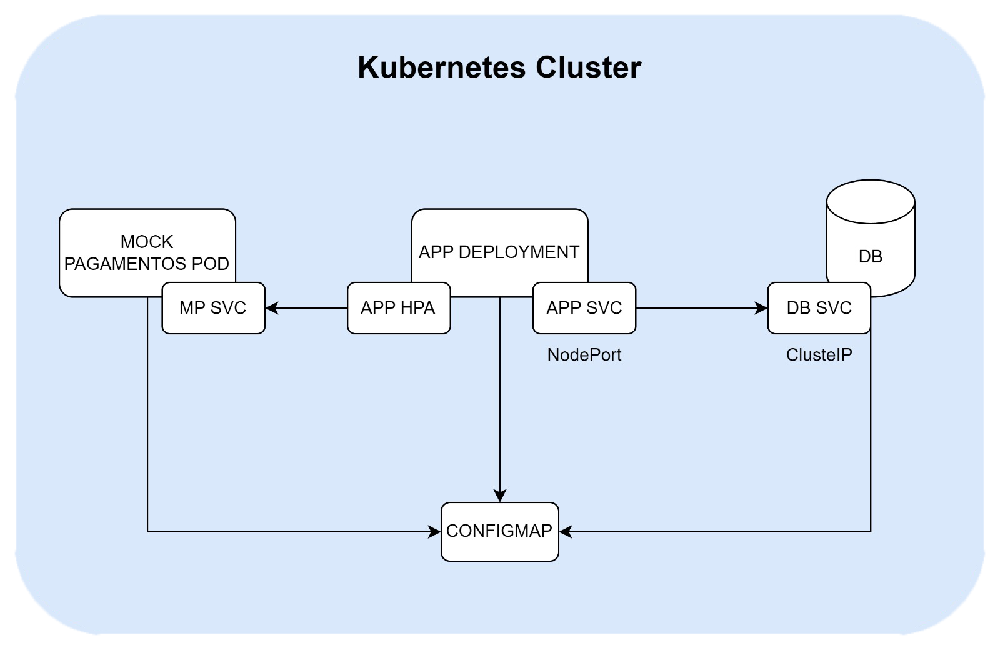

## Arquitetura Kubernetes

O diagrama abaixo ilustra a arquitetura projetada para nossa aplicação executar utilizando um cluster Kubernetes:

<figure markdown>
  { width="600" }
  <figcaption>Diagrama da Arquitetura Kubernetes</figcaption>
</figure>

Podemos sintetizar os seguintes *requisitos de negócio* contemplados pela arquitetura:

**1. Disponibilidade e Escalabilidade**: A utilização de Deployments e Services, juntamente com o Horizontal Pod Autoscaler (HPA), garante que a aplicação esteja sempre disponível para os usuários. O HPA permite que a aplicação escale automaticamente com base na demanda, atendendo a picos de tráfego sem intervenção manual.

**2. Gerenciamento de Configuração**: O uso de ConfigMaps para armazenar configurações externas, como informações de conexão ao banco de dados e URLs de serviços, permite uma gestão centralizada e flexível das configurações. Isso facilita ajustes e atualizações sem a necessidade de reconstruir ou reiniciar os containers.

**3. Isolamento e Segurança**: A separação do banco de dados e do serviço mock de pagamentos em Pods distintos, juntamente com a comunicação através de Services, promove o isolamento entre os componentes da aplicação. Isso melhora a segurança, limitando o acesso apenas aos recursos necessários para cada componente.

**4. Integração e Testes**: A implementação de um serviço mock de pagamentos permite a simulação de interações com sistemas de pagamento externos, facilitando o desenvolvimento e os testes da integração de pagamentos na aplicação. Isso garante que a aplicação possa ser testada de forma abrangente em um ambiente controlado antes de ser conectada a serviços de pagamento reais.

**5. Monitoramento e Saúde da Aplicação**: A inclusão de liveness e readiness probes nos manifestos tem como objetivo o monitoramento e preocupação com a saúde da aplicação. Essas probes ajudam a garantir que o Kubernetes possa gerenciar automaticamente a saúde dos Pods, reiniciando-os se eles não estiverem respondendo adequadamente.

**6. Eficiência de Recursos**: A especificação de recursos mínimos necessários para os containers, como CPU, no manifesto do Deployment, assegura que a aplicação utilize os recursos do cluster de forma eficiente, evitando o uso excessivo e permitindo uma melhor distribuição dos recursos disponíveis no cluster.

Esses requisitos refletem uma arquitetura projetada para ser resiliente, segura, e fácil de gerenciar e escalar, atendendo às necessidades de uma aplicação moderna em um ambiente de cloud como o Kubernetes.

---

## Tutorial para Execução da Aplicação com Kubernetes

**1. Aplicar o ConfigMap**

O ConfigMap contém configurações essenciais para a aplicação e o banco de dados.

```bash
kubectl apply -f configmap.yaml
```
   
**2. Inicializar o Serviço do Banco de Dados**
   
Cria o serviço que permite a comunicação com o banco de dados PostgreSQL.

```bash
kubectl apply -f db-svc.yaml
```

**3. Inicializar o Pod do Banco de Dados**
   
Cria o Pod que executa o container do PostgreSQL.

```bash
kubectl apply -f db-postgres.yaml
```
   
**4. Verificar as Migrations do Banco de Dados**
   
Útil para assegurar que o banco de dados foi inicializado corretamente.

```bash
kubectl logs db-pod
```

**5. Inicializar o Metrics Server**
   
Necessário para o funcionamento do Horizontal Pod Autoscaler (HPA).

```bash
kubectl apply -f app-metrics.yaml
```
   
**6. Inicializar o Serviço da Aplicação**
   
Cria o serviço que expõe a aplicação.

```bash
kubectl apply -f app-svc.yaml
```
   
**7. Aplicar o Horizontal Pod Autoscaler**
   
Configura o HPA para escalabilidade automática da aplicação.

```bash
kubectl apply -f app-hpa.yaml
```

**8. Inicializar o Deployment da Aplicação**
   
Cria o Deployment que gerencia os Pods da aplicação.

```bash
kubectl apply -f app-deployment.yaml
```

**9. Verificar se a Aplicação Iniciou Corretamente**
   
Lista os Pods para encontrar o nome do Pod da aplicação e verificar os logs.

```bash
kubectl get pods
# Substitua `<nome_pod>` pelo nome do Pod da aplicação obtido no passo anterior.
kubectl logs <nome_pod>
```
   
**10. Inicializar o Serviço Mock de Pagamentos**
   
Cria o serviço que expõe o mock de pagamentos.

```bash
kubectl apply -f mock-pagamento-svc.yaml
```
   
**11. Inicializar o Pod do Mock de Pagamentos**
   
Cria o Pod que executa o mock de pagamentos.

```bash
kubectl apply -f mock-pagamento-pod.yaml
```
   
**12. Verificar se o Mock de Pagamentos Subiu Corretamente**
   
```bash
kubectl logs mock-pagamentos-pod
```
   
**13. Desligar a Infraestrutura**
   
Quando terminar, remova todos os recursos criados. Este comando remove todos os recursos dos tipos especificados no namespace atual

```bash
kubectl delete --all pods
kubectl delete --all deployments
kubectl delete --all services
kubectl delete --all hpa
kubectl delete --all configmaps
```

---

## Tutorial para Interação com as APIs

Esta seção fornece uma visão geral dos endpoints disponíveis para o serviço de autoatendimento em construção. Para testar os endpoints interativamente, utilize nossa **Swagger UI** disponibilizada ao fazer o build da aplicação.

!!! POSTMAN "Utilizando a collection no Postman"

    Disponibilizamos [aqui](https://github.com/postech-5soat-grupo-25/tech_challenge/blob/main/.postman/collection.json) uma _collection_ no **Postman** para facilitar as interações com os endpoints da aplicação. Estão listados diversos cenários de uso e para utilizá-los basta importar a _collection_ alterar os parâmetros das requisições diretamente no Postman.


### 1. Autenticação

A primeira etapa é a obtenção de um _bearer token_ de acesso através da realização do login na aplicação. Para isso, basta utilizar o endpoint abaixo passando os devidos parâmetros no corpo da requisição:

??? POST "/auth/login"

    Autentica o usuário e retorna um token de acesso.

    | Parâmetro | Tipo     | Descrição       |
    |-----------|----------|-----------------|
    | cpf       | `string` | CPF do usuário. |
    | senha     | `string` | Senha do usuário. |

    !!! QUOTE ""
        Disponibilizamos um usuário administrativo padrão pré-cadastrado que poderá utilizar para autenticação na aplicação. Para isso, basta utilizar os seguintes parâmetros:

        ```
        {
            "cpf": "000.000.000-00",
            "senha": "melhor_projeto"
        }
        ```

### 2. Usuários

Esta seção detalha os endpoints disponíveis para gerenciamento de usuários na aplicação. Esses endpoints permitem criar, recuperar, atualizar e deletar informações de usuários.

??? GET "/usuarios/"
  
    Recupera uma lista de todos os usuários cadastrados na aplicação.

??? POST "/usuarios/"
  
    Cria um novo usuário com as informações fornecidas no corpo da requisição.

    | Parâmetro | Tipo     | Descrição       |
    |-----------|----------|-----------------|
    | nome      | `string` | Nome do usuário.|
    | email     | `string` | Email do usuário.|
    | senha     | `string` | Senha do usuário.|
    | cpf       | `string` | CPF do usuário.|
    | tipo      | `string` | Tipo do usuário (`Admin` ou `Cozinha`).|
    | status    | `string` | Status do usuário (`Ativo` ou `Inativo`).|

    > É necessário informar um **CPF** válido no formato `123.456.789-00`;

??? GET "/usuarios/{id}"
  
    Recupera os detalhes de um usuário específico pelo seu ID.

    | Parâmetro | Tipo      | Descrição         |
    |-----------|-----------|-------------------|
    | id        | `integer` | ID do usuário.    |


??? PUT "/usuarios/{id}"
  
    Atualiza as informações de um usuário específico pelo seu ID com os dados fornecidos no corpo da requisição.

    | Parâmetro | Tipo      | Descrição         |
    |-----------|-----------|-------------------|
    | id        | `integer` | ID do usuário.    |

??? DEL "/usuarios/{cpf}"
  
    Remove um usuário específico pelo seu CPF da aplicação.

    | Parâmetro | Tipo     | Descrição       |
    |-----------|----------|-----------------|
    | cpf       | `string` | CPF do usuário. |

### 3. Clientes

Esta seção detalha os endpoints disponíveis para gerenciamento de clientes na aplicação. Esses endpoints permitem criar, recuperar informações de clientes.

??? GET "/clientes/"
  
    Recupera uma lista de todos os clientes cadastrados na aplicação.

??? POST "/clientes/"
  
    Cadastra um novo cliente com as informações fornecidas no corpo da requisição.

    | Parâmetro | Tipo     | Descrição          |
    |-----------|----------|--------------------|
    | nome      | `string` | Nome do cliente.   |
    | email     | `string` | Email do cliente.  |
    | cpf       | `string` | CPF do cliente.    |

    > É necessário informar um *CPF* válido no formato `123.456.789-00`;

??? GET "/clientes/{cpf}"
  
    Recupera os detalhes de um cliente específico pelo seu CPF.

    | Parâmetro | Tipo     | Descrição        |
    |-----------|----------|------------------|
    | cpf       | `string` | CPF do cliente.  |

### 4. Produtos

Esta seção detalha os endpoints disponíveis para gerenciamento de produtos na aplicação. Esses endpoints permitem criar, recuperar, atualizar e deletar informações de produtos.

??? GET "/produtos/"
  
    Recupera uma lista de todos os produtos cadastrados na aplicação.

??? POST "/produtos/"
  
    Cadastra um novo produto com as informações fornecidas no corpo da requisição.

    | Parâmetro    | Tipo       | Descrição                |
    |--------------|------------|--------------------------|
    | nome         | `string`   | Nome do produto.         |
    | foto         | `string`   | URL da foto do produto.  |
    | descricao    | `string`   | Descrição do produto.    |
    | categoria    | `string`   | Categoria do produto (`Lanche`, `Bebida`, `Acompanhamento`, `Sobremesa`). |
    | preco        | `number`   | Preço do produto.        |
    | ingredientes | `string[]` | Lista de ingredientes do produto. |

??? GET "/produtos/{id}"
  
    Recupera os detalhes de um produto específico pelo seu ID.

    | Parâmetro | Tipo      | Descrição         |
    |-----------|-----------|-------------------|
    | id        | `integer` | ID do produto.    |

??? PUT "/produtos/{id}"
  
    Atualiza as informações de um produto específico pelo seu ID com os dados fornecidos no corpo da requisição.

    | Parâmetro | Tipo      | Descrição         |
    |-----------|-----------|-------------------|
    | id        | `integer` | ID do produto.    |

??? DEL "/produtos/{id}"
  
    Remove um produto específico pelo seu ID da aplicação.

    | Parâmetro | Tipo      | Descrição         |
    |-----------|-----------|-------------------|
    | id        | `integer` | ID do produto.    |

### 5. Pedidos

Esta seção detalha os endpoints disponíveis para gerenciamento de pedidos na aplicação. Esses endpoints permitem criar, recuperar, atualizar o status de pedidos, associar clientes e produtos a pedidos, e registrar pagamentos.

??? GET "/pedidos/"
  
    Recupera uma lista de todos os pedidos cadastrados na aplicação.

??? POST "/pedidos/"
  
    Cria um novo pedido com as informações fornecidas no corpo da requisição.

??? GET "/pedidos/novos"
  
    Recupera uma lista de pedidos recentemente criados que ainda não foram processados.

??? PUT "/pedidos/{id}/status/{status}"
  
    Atualiza o status de um pedido específico.

    | Parâmetro | Tipo      | Descrição               |
    |-----------|-----------|-------------------------|
    | id        | `integer` | ID do pedido.           |
    | status    | `string`  | Novo status do pedido.  |

??? PUT "/pedidos/{id}/cliente/{cliente_id}"
  
    Associa um cliente a um pedido específico.

    | Parâmetro  | Tipo      | Descrição               |
    |------------|-----------|-------------------------|
    | id         | `integer` | ID do pedido.           |
    | cliente_id | `integer` | ID do cliente a ser associado ao pedido. |

??? PUT "/pedidos/{id}/produto/{categoria}/{produto_id}"
  
    Adiciona um produto a um pedido específico, categorizando o produto adicionado.

    | Parâmetro  | Tipo      | Descrição                        |
    |------------|-----------|----------------------------------|
    | id         | `integer` | ID do pedido.                    |
    | categoria  | `string`  | Categoria do produto a ser adicionado. |
    | produto_id | `integer` | ID do produto a ser adicionado ao pedido. |

??? PUT "/pedidos/{id}/pagamento"
  
    Registra o pagamento de um pedido específico.

    | Parâmetro | Tipo      | Descrição               |
    |-----------|-----------|-------------------------|
    | id        | `integer` | ID do pedido.           |

