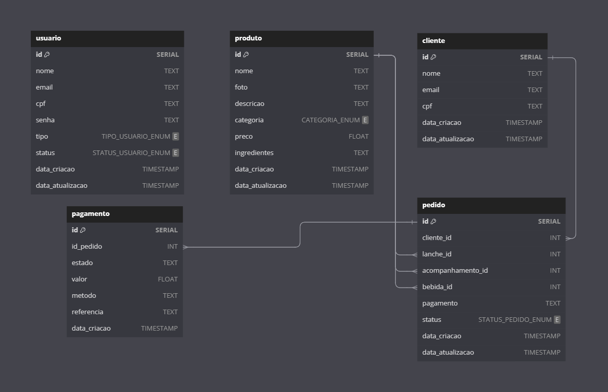

#  Detalhes do Banco de Dados

## Escolha do PostgreSQL

Optamos pelo PostgreSQL como a solução de banco de dados para o sistema de autoatendimento após uma cuidadosa avaliação de diferentes formatos de bancos de dados. A decisão foi baseada na robustez, flexibilidade e no conjunto de recursos avançados que o PostgreSQL oferece, os quais se alinham perfeitamente com as necessidades complexas e em evolução do nosso projeto. 

Em comparação com outras opções, o PostgreSQL se destacou por sua capacidade de lidar com dados complexos, extensibilidade, confiabilidade, suporte a concorrência, segurança avançada, recursos de pesquisa sofisticados, uma comunidade ativa e um modelo de custo eficiente. A seguir, detalhamos as razões que justificam essa escolha:

- **Compatibilidade com Dados Complexos**: O PostgreSQL suporta uma ampla gama de tipos de dados, incluindo tipos primitivos, como numérico, string e booleano, bem como tipos de dados mais complexos, como arrays, JSON/B, e tipos definidos pelo usuário. Isso é essencial para armazenar detalhes complexos de pedidos e preferências de clientes.
- **Extensibilidade**: O PostgreSQL é altamente extensível, permitindo definir funções, operadores e até tipos de dados personalizados. Isso facilita a adaptação e expansão do sistema conforme as necessidades do negócio evoluem.
- **Confiabilidade e Integridade dos Dados**: Conhecido por sua alta confiabilidade, o PostgreSQL suporta transações ACID, garantindo a integridade dos dados mesmo em caso de falhas do sistema.
- **Suporte a Concorrência**: Graças ao seu modelo de concorrência baseado em MVCC, o PostgreSQL pode processar muitas transações simultâneas sem bloqueios significativos, essencial para um sistema de autoatendimento que lida com múltiplos pedidos ao mesmo tempo.
- **Segurança**: Oferece um robusto sistema de controle de acesso baseado em funções e suporta autenticação forte e SSL, protegendo os dados contra acessos não autorizados.
- **Recursos de Pesquisa Avançada**: Com índices GIN e GiST, o PostgreSQL executa eficientemente consultas complexas, incluindo buscas em textos completos e operações geoespaciais, útil para análises avançadas e melhorias na interface de usuário.
- **Comunidade e Suporte**: Possui uma comunidade ativa e um vasto ecossistema de ferramentas e extensões, facilitando o suporte e acesso a recursos para desenvolvimento e manutenção.
- **Custo**: Sendo de código aberto, o PostgreSQL é gratuito, ajudando a reduzir os custos iniciais de desenvolvimento e implementação.

### Modelagem

<figure markdown>
  { width="600" }
  <figcaption>Diagrama de Entidade e Relacionamento</figcaption>
</figure>

#### Entidades

`usuario`

  - Chave Primária: *id*
  - Atributos: *nome, email, cpf, senha, tipo, status, data_criacao, data_atualizacao*

`produto`

  - Chave Primária: *id*
  - Atributos: *nome, foto, descricao, categoria, preco, ingredientes, data_criacao, data_atualizacao*

`cliente`

   - Chave Primária: *id*
   - Atributos: *nome, email, cpf, data_criacao, data_atualizacao*

`pedido`

   - Chave Primária: *id*
   - Atributos: *cliente_id, lanche_id, acompanhamento_id, bebida_id, pagamento, status, data_criacao, data_atualizacao*
   - Relações:
     - *cliente_id* é uma chave estrangeira que referencia `cliente`(*id*)
     - *lanche_id*, *acompanhamento_id*, *bebida_id* são chaves estrangeiras que referenciam `produto`(*id*)

`pagamento`

   - Chave Primária: *id*
   - Atributos: *id_pedido, estado, valor, metodo, referencia, data_criacao*
   - Relações:
     - *id_pedido* é uma chave estrangeira que referencia `pedido`(*id*)

### Relacionamentos

- `pedido` para `cliente`: Um relacionamento de muitos para um (N:1), onde cada pedido está associado a um único cliente, mas um cliente pode ter vários pedidos.
- `pedido` para `produto`: Um relacionamento de muitos para muitos (N:N), representado através das chaves estrangeiras *lanche_id*, *acompanhamento_id*, *bebida_id* em pedido, indicando que um pedido pode incluir vários produtos e um produto pode estar em vários pedidos.
- `pagamento` para `pedido`: Um relacionamento de um para um (1:1) ou um para muitos (1:N), dependendo de como os pagamentos são gerenciados. Cada pagamento está associado a um único pedido, mas um pedido pode ter vários pagamentos se forem permitidos pagamentos parciais.

### Tabelas

#### `usuario`

Projetada para armazenar informações essenciais sobre os usuários que interagem com o sistema, sejam eles funcionários da cozinha, administradores ou qualquer outro tipo de usuário que necessite de acesso ao sistema administrativo. Esta tabela é fundamental para o controle de acesso e a gestão de permissões dentro do sistema.

| Nome da Coluna   | Tipo de Dado          | Descrição                            |
| ---------------- | --------------------- | ------------------------------------ |
| id               | `SERIAL`              | Identificador único do usuário       |
| nome             | `TEXT`                | Nome do usuário                      |
| email            | `TEXT`                | E-mail do usuário                    |
| cpf              | `TEXT`                | CPF do usuário                       |
| senha            | `TEXT`                | Senha do usuário                     |
| tipo             | `TIPO_USUARIO_ENUM`   | Tipo do usuário (Admin ou Cozinha)   |
| status           | `STATUS_USUARIO_ENUM` | Status do usuário (Ativo ou Inativo) |
| data_criacao     | `TIMESTAMP`           | Data de criação do registro          |
| data_atualizacao | `TIMESTAMP`           | Data de atualização do registro      |

#### `produto`

Projetada para armazenar informações sobre os produtos oferecidos pela lanchonete, como lanches, bebidas, acompanhamentos e sobremesas. Esta tabela é essencial para o catálogo de produtos do sistema de autoatendimento, permitindo aos clientes visualizar detalhes como nome, descrição, preço e ingredientes de cada produto.

| Nome da Coluna    | Tipo de Dado            | Descrição                              |
|-------------------|-------------------------|----------------------------------------|
| id                | `SERIAL`                | Identificador único do produto         |
| nome              | `TEXT`                  | Nome do produto                        |
| foto              | `TEXT`                  | URL da foto do produto                 |
| descricao         | `TEXT`                  | Descrição do produto                   |
| categoria         | `CATEGORIA_ENUM`        | Categoria do produto                   |
| preco             | `FLOAT`                 | Preço do produto                       |
| ingredientes      | `TEXT []`               | Lista de ingredientes do produto       |
| data_criacao      | `TIMESTAMP`             | Data de criação do registro            |
| data_atualizacao  | `TIMESTAMP`             | Data de atualização do registro        |

#### `cliente`

Projetada para armazenar informações sobre os clientes que utilizam o sistema de autoatendimento. Armazenar os dados dos clientes permite ao sistema oferecer uma experiência personalizada e facilitar o processo de pedidos.

| Nome da Coluna    | Tipo de Dado            | Descrição                              |
|-------------------|-------------------------|----------------------------------------|
| id                | `SERIAL`                | Identificador único do cliente         |
| nome              | `TEXT`                  | Nome do cliente                        |
| email             | `TEXT`                  | E-mail do cliente                      |
| cpf               | `TEXT`                  | CPF do cliente                         |
| data_criacao      | `TIMESTAMP`             | Data de criação do registro            |
| data_atualizacao  | `TIMESTAMP`             | Data de atualização do registro        |

#### `pedido`

Essencial para o registro e acompanhamento dos pedidos realizados no sistema de autoatendimento. Vincula pedidos a clientes e detalha os itens selecionados, além de armazenar o status do pedido.

| Nome da Coluna       | Tipo de Dado            | Descrição                              |
|----------------------|-------------------------|----------------------------------------|
| id                   | `SERIAL`                | Identificador único do pedido          |
| cliente_id           | `INT`                   | ID do cliente que fez o pedido         |
| lanche_id            | `INT`                   | ID do lanche no pedido                 |
| acompanhamento_id    | `INT`                   | ID do acompanhamento no pedido         |
| bebida_id            | `INT`                   | ID da bebida no pedido                 |
| pagamento            | `TEXT`                  | Informação de pagamento                |
| status               | `STATUS_PEDIDO_ENUM`    | Status do pedido                       |
| data_criacao         | `TIMESTAMP`             | Data de criação do registro            |
| data_atualizacao     | `TIMESTAMP`             | Data de atualização do registro        |

#### `pagamento`

Projetada para registrar detalhes das transações financeiras associadas a cada pedido, crucial para o gerenciamento financeiro do sistema de autoatendimento.

| Nome da Coluna    | Tipo de Dado            | Descrição                              |
|-------------------|-------------------------|----------------------------------------|
| id                | `SERIAL`                | Identificador único do pagamento       |
| id_pedido         | `INT`                   | ID do pedido associado                 |
| estado            | `TEXT`                  | Estado do pagamento                    |
| valor             | `FLOAT`                 | Valor do pagamento                     |
| metodo            | `TEXT`                  | Método de pagamento utilizado          |
| referencia        | `TEXT`                  | Referência da transação                |
| data_criacao      | `TIMESTAMP`             | Data de criação do registro            |

## AWS RDS para PostgreSQL

No projeto, optamos pelo Amazon Relational Database Service (RDS) para implementar nossa instância do banco de dados PostgreSQL. A escolha do AWS RDS é fundamentada em sua capacidade de fornecer uma solução de banco de dados relacional escalável, segura e de alta disponibilidade, com gerenciamento simplificado, o que nos permite focar no desenvolvimento da aplicação sem a necessidade de dedicar recursos significativos à administração do banco de dados.

!!! GITHUB "postech-5soat-grupo-25/tech_challenge-database"
    [Acesse o repositório para mais detalhes!](https://github.com/postech-5soat-grupo-25/tech_challenge-database)

O AWS RDS oferece várias vantagens que o tornam uma escolha ideal para a implementação do nosso banco de dados PostgreSQL:

- **Gerenciamento Simplificado**: O RDS automatiza tarefas administrativas como provisionamento de hardware, configuração de banco de dados, patching de software e backups, permitindo que nossa equipe se concentre mais no desenvolvimento e menos na manutenção.
- **Escalabilidade**: Com o RDS, podemos facilmente escalar a capacidade de computação ou armazenamento do nosso banco de dados conforme necessário, sem tempo de inatividade.
- **Disponibilidade e Durabilidade**: O RDS facilita a configuração de réplicas de leitura e backups automáticos, garantindo alta disponibilidade e recuperação de desastres.
- **Segurança**: O serviço oferece recursos robustos de segurança, incluindo o isolamento de rede com Amazon VPC, criptografia em trânsito e em repouso, e controle de acesso detalhado.

### Configurações para o Free Tier

Para garantir a aderência ao _free tier_ da AWS e otimizar os custos, configuramos nossa instância do PostgreSQL no RDS com as seguintes especificações:

- _Tipo de Instância_: `db.t3.micro`, adequado para ambientes de teste ou pequenas aplicações, e elegível para o free tier da AWS.
- _Armazenamento Alocado_: `10 GB`, dentro do limite do free tier, proporcionando espaço suficiente para o desenvolvimento inicial e testes.
- _Engine Version_: Escolhemos a versão mais recente compatível com o free tier para garantir melhor desempenho e segurança.

### Configurações de Rede

Para garantir uma gestão eficaz e segura da infraestrutura de rede que suporta o acesso ao nosso banco de dados PostgreSQL hospedado no AWS RDS, optamos por separar a configuração de rede em seu próprio repositório dedicado. Essa abordagem modular nos permite focar especificamente nas necessidades de segurança, escalabilidade e gerenciamento da rede, facilitando a manutenção e a aplicação de melhores práticas de segurança de forma isolada. Através deste repositório de rede, implementamos uma série de recursos e políticas para gerenciar eficientemente o tráfego de rede, permitindo o acesso seguro ao banco de dados enquanto restringimos conexões não autorizadas.

!!! GITHUB "postech-5soat-grupo-25/tech_challenge-network"
    [Acesse o repositório para mais detalhes!](https://github.com/postech-5soat-grupo-25/tech_challenge-network)

#### VPC e Sub-redes

- **Amazon Virtual Private Cloud** (VPC): Criamos uma VPC dedicada para isolar nossa infraestrutura de banco de dados na AWS. Isso nos permite controlar o ambiente de rede, incluindo a seleção de intervalos de IP, criação de sub-redes e configuração de tabelas de rotas.
- **Sub-redes Públicas e Privadas**: Dentro da VPC, configuramos sub-redes públicas e privadas. O banco de dados é colocado em sub-redes privadas para restringir o acesso direto da internet, aumentando a segurança.

#### Grupos de Segurança

- **Grupos de Segurança para o RDS**: Configuramos grupos de segurança específicos para o banco de dados PostgreSQL no RDS, atuando como um firewall virtual que controla o tráfego de entrada e saída. As regras de entrada são cuidadosamente definidas para permitir conexões apenas de IPs ou sub-redes específicas necessárias para a operação da aplicação, enquanto todo o tráfego não autorizado é bloqueado.

#### Conectividade Segura

- **Gateway de Internet e NAT**: Para permitir que o banco de dados acesse a internet para atualizações e patches, sem expô-lo diretamente, utilizamos um Gateway de Internet para as sub-redes públicas e uma instância NAT para as sub-redes privadas. Isso garante que o banco de dados possa se comunicar com a internet de maneira segura.
- **Grupos de Sub-redes do RDS**: Ao associar o banco de dados a grupos de sub-redes específicos, garantimos que ele possa operar em múltiplas zonas de disponibilidade, aumentando a disponibilidade e a resiliência.
