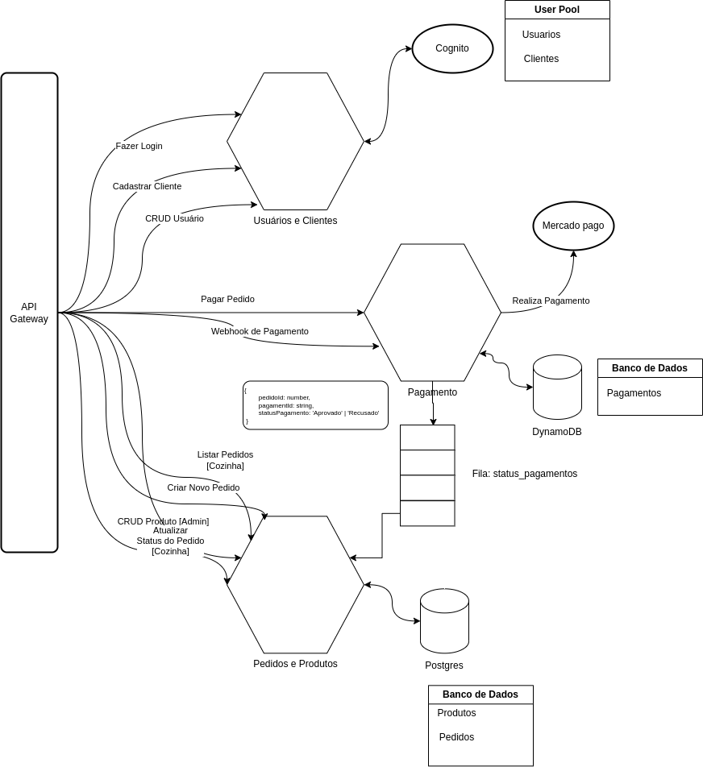

# Aplicação do Padrão SAGA

## Arquitetura de Microserviços

<figure markdown>
  { width="600" }
  <figcaption>Arquitetura de Microserviços</figcaption>
</figure>

!!! GITHUB "Repositórios dos microserviços que compõem a arquitetura"
    - **`pedido-produto`**: [postech-5soat-grupo-25/tech-challenge-pedido-produto](https://github.com/postech-5soat-grupo-25/tech-challenge-pedido-produto)
    - **`usuario-cliente`**: [postech-5soat-grupo-25/tech-challenge-usuario-cliente](https://github.com/postech-5soat-grupo-25/tech-challenge-usuario-cliente)
    - **`pagamento`**: [postech-5soat-grupo-25/tech-challenge-pagamento](https://github.com/postech-5soat-grupo-25/tech-challenge-pagamento)
    - **`auth`**: [postech-5soat-grupo-25/tech-challenge-auth](https://github.com/postech-5soat-grupo-25/tech-challenge-auth)

---

## SAGA Coreografada

No gerenciamento dos status de pagamentos dos pedidos no projeto, optamos por implementar uma **SAGA coreografada** utilizando **RabbitMQ** como sistema de mensageria. Essa escolha foi baseada nas seguintes justificativas:

- **Desacoplamento e Escalabilidade**: A SAGA coreografada permite um desacoplamento entre os diferentes serviços envolvidos no processo de pagamento e gestão de pedidos. Isso facilita a escalabilidade do sistema, pois cada serviço pode ser desenvolvido, implantado e escalado independentemente.
- **Resiliência e Tolerância a Falhas**: A coreografia permite que o sistema seja mais resiliente a falhas, já que os serviços comunicam-se entre si de forma assíncrona. Caso um serviço falhe, o restante do sistema continua funcionando e pode lidar com a falha de maneira controlada, garantindo que o sistema como um todo permaneça operacional.
- **Gerenciamento de Transações Distribuídas**: Com a SAGA, é possível gerenciar transações distribuídas de maneira eficiente, garantindo que as operações sejam realizadas de forma consistente mesmo em um ambiente com múltiplos serviços. Isso é crucial para manter a integridade dos dados, especialmente quando lidamos com pagamentos e status de pedidos.
- **Flexibilidade e Manutenção**: A abordagem coreografada oferece maior flexibilidade na adição ou modificação de serviços no futuro. Se novos requisitos surgirem ou se for necessário adicionar novas etapas ao processo, essas alterações podem ser feitas com impacto mínimo no sistema existente.

!!! RABBITMQ "Por que escolhemos o RabbitMQ?"

    O RabbitMQ foi escolhido como a solução de mensageria para suportar a SAGA coreografada devido às seguintes razões:

    - **Alta Performance e Escalabilidade**: é conhecido por sua alta performance e capacidade de escalar horizontalmente, o que é essencial para lidar com um grande volume de mensagens e garantir que o sistema possa crescer conforme a demanda.
    - **Gerenciamento Eficiente de Mensagens**: oferece suporte robusto para o gerenciamento de mensagens, incluindo roteamento complexo, entrega garantida e recuperação de falhas. Isso assegura que as mensagens sobre o status dos pedidos sejam entregues de forma confiável entre os serviços.
    - **Suporte a Transações e Persistência**: permite a persistência de mensagens e o suporte a transações, o que é vital para garantir que as mensagens sobre o status dos pedidos não sejam perdidas, mesmo em caso de falhas no sistema.
    - **Integração e Compatibilidade**: é altamente compatível com uma variedade de linguagens e frameworks, facilitando a integração com diferentes componentes do sistema e permitindo que os serviços de diferentes stacks tecnológicos se comuniquem de forma eficiente.

A combinação da SAGA coreografada com RabbitMQ proporciona um ambiente robusto e flexível para o gerenciamento dos status de pagamentos e pedidos. Essa abordagem não apenas melhora a escalabilidade e a resiliência do sistema, mas também oferece a flexibilidade necessária para atender às necessidades em constante evolução do projeto. A escolha dessas tecnologias reflete um compromisso com a eficiência operacional e a capacidade de lidar com as complexidades de um sistema distribuído moderno.