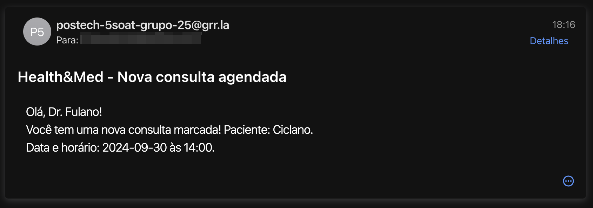

# :material-clipboard-pulse: Health&Med

## Gerenciador de Consultas

!!! BUG ""
    O objetivo desse projeto é solucionar um gargalo operacional enfrentado pela Health&Med, uma operadora de saúde que ainda realiza agendamentos de consultas exclusivamente por telefone. Esse processo manual resulta em baixa eficiência, dificuldades na gestão de horários, e insatisfação tanto para médicos quanto para pacientes. Para otimizar esse fluxo, desenvolvemos um sistema 100% digital que automatiza o processo de agendamento e cadastro de usuários.

---

O principal problema identificado pela Health&Med é o processo manual de agendamento de consultas médicas. Atualmente, os pacientes precisam ligar para uma central de atendimento, o que cria um gargalo no processo, causando atrasos e reduzindo a satisfação do cliente. Além disso, a gestão de horários de médicos e a validação de conflitos de agenda não são bem gerenciadas. Com o crescimento da empresa, esse problema tende a piorar, comprometendo ainda mais a operação.

Diante desses desafios, optamos por uma abordagem baseada na separação das responsabilidades em dois serviços: `usuarios` e `agendamento`.

---

### Serviço de `usuarios`

É responsável por gerenciar o cadastro e a autenticação de médicos e pacientes. Ele oferece funcionalidades essenciais, como registro de novos usuários, atualização de informações pessoais e, embora não implemente um sistema de login tradicional, assegura a criação de perfis seguros para cada usuário. O serviço inclui também validações rigorosas e medidas de segurança para proteger dados pessoais sensíveis, garantindo que as informações dos usuários estejam sempre seguras e acessíveis apenas a eles.

!!! TYPESCRIPT "TypeScript"
    O serviço foi projetado para gerenciar o cadastro e a classificação de diferentes tipos de usuários dentro do sistema, utilizando TypeScript. Ao focar exclusivamente no processo de cadastro, este serviço garante uma abordagem simplificada e eficaz para a criação de perfis de usuário. Cada tipo de usuário possui atributos e características específicas que são gerenciados de forma centralizada, permitindo uma organização clara das informações e facilitando futuras expansões. Essa separação de responsabilidades permite que o serviço de usuários se concentre em sua função principal, otimizando a manutenção e a escalabilidade do sistema como um todo.

!!! GITHUB "postech-5soat-grupo-25/hackathon-usuarios"
    [Acesse o repositório para mais detalhes!](https://github.com/postech-5soat-grupo-25/hackathon-usuarios)

---

### Serviço de `agendamento`

É responsável pela gestão eficiente de horários e consultas. Este serviço permite que médicos configurem sua disponibilidade para atendimentos, enquanto os pacientes podem agendar consultas com base nos horários disponíveis. Para evitar conflitos de horários, o serviço implementa uma lógica robusta que assegura que não haja sobreposição de consultas. Além disso, após cada agendamento, um e-mail de notificação é enviado ao médico, contendo todos os detalhes da consulta marcada, mantendo todos os envolvidos informados e organizados.

!!! GO "Go"
    A implementação em Go foi escolhida devido à sua capacidade de manipular operações concorrentes através das goroutines. Essa característica permite que o serviço gerencie múltiplas requisições de agendamento de forma eficiente, garantindo que a aplicação permaneça responsiva mesmo em situações de alta demanda. A utilização do Go também proporciona um desempenho robusto, ideal para operações que exigem rapidez e eficiência. Além disso, a estrutura simples do Go facilita a implementação de lógica de agendamento, contribuindo para um sistema mais ágil e menos suscetível a falhas.

!!! GITHUB "postech-5soat-grupo-25/hackathon-agendamento"
    [Acesse o repositório para mais detalhes!](https://github.com/postech-5soat-grupo-25/hackathon-agendamento)

A decisão de separar o sistema em dois serviços surgiu da necessidade de manter uma clara _divisão de responsabilidades_, facilitando a _escalabilidade_ e _manutenção_ do sistema no futuro. Com isso, conseguimos isolar as funcionalidades principais, permitindo que alterações em uma parte do sistema de cadastro de usuários não impactem diretamente no serviço de agendamento, e vice-versa.

---

### Infraestrutura

A infraestrutura do projeto é construída sobre os princípios da _escalabilidade_ e _resiliência_, aproveitando os serviços da AWS para garantir uma operação eficiente e segura. No coração da arquitetura, o **Elastic Container Service** (ECS) é utilizado para orquestrar os containers que hospedam os serviços de usuários e agendamento. Essa escolha permite o gerenciamento simplificado dos ambientes de execução, além de facilitar a implantação e o escalonamento automático conforme a demanda dos usuários.

Para garantir a alta disponibilidade e distribuir a carga de trabalho, um **Elastic Load Balancer** (ELB) é integrado à solução. O ELB atua como um ponto de entrada para as requisições, direcionando-as de maneira eficiente entre as instâncias do ECS, garantindo que o tráfego seja distribuído de forma equilibrada e que os serviços permaneçam acessíveis mesmo em caso de falhas em algumas instâncias. Essa configuração não apenas melhora a performance, mas também contribui para a resiliência geral da aplicação.

O Amazon **API Gateway** é utilizado como um intermediário para gerenciar as requisições entre os clientes e os serviços de backend. Ele permite a definição de rotas e métodos HTTP, facilitando a implementação de endpoints para operações como agendamento e envio de e-mails. O API Gateway oferece recursos como autenticação, controle de acesso e monitoramento, tornando-se uma peça fundamental na segurança e na gestão das interações entre usuários e serviços.

Adicionalmente, o projeto utiliza AWS **Cognito** para gerenciar a autenticação de usuários, permitindo que médicos e pacientes tenham um acesso seguro e controlado à aplicação. A integração com o Amazon **Simple Email Service** (SES) é implementada para enviar notificações e confirmações de agendamentos, assegurando que a comunicação entre a aplicação e os usuários seja clara e eficaz.

Em termos de infraestrutura como código, o **Terraform** é empregado para automatizar a criação e o gerenciamento dos recursos da AWS, promovendo a consistência e a reusabilidade da infraestrutura. Com essa abordagem, a equipe pode rapidamente implementar mudanças e escalar a solução conforme necessário, garantindo uma base sólida para o crescimento futuro.

As funcionalidades de _login_ e _envio de e-mails_ foram posicionadas próximas ao API Gateway, evitando a necessidade de um serviço dedicado para essas operações simples. Essa abordagem simplifica a interação entre o frontend e o backend, utilizando soluções nativas da AWS para autenticação e comunicação. A escolha de implementar o login com a integração ao Cognito permite uma gestão segura dos usuários, enquanto o envio de e-mails é tratado através do SES, garantindo que as notificações de agendamentos sejam enviadas de forma confiável e em tempo hábil. Essa estrutura não só melhora a eficiência do sistema, mas também proporciona uma experiência de usuário fluida e direta.

!!! GITHUB "postech-5soat-grupo-25/hackathon-infra"
    [Acesse o repositório para mais detalhes!](https://github.com/postech-5soat-grupo-25/hackathon-infra)

Abaixo temos um exemplo de e-mail enviado pela solução:

<figure markdown>
  { width="600" }
  <figcaption></figcaption>
</figure>
